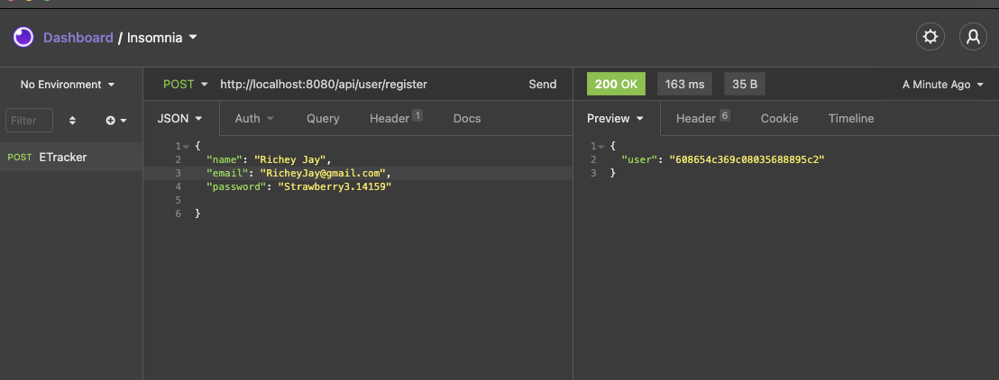
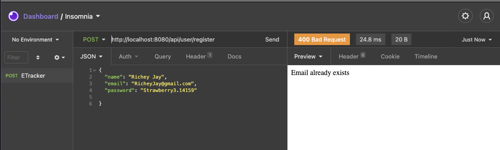
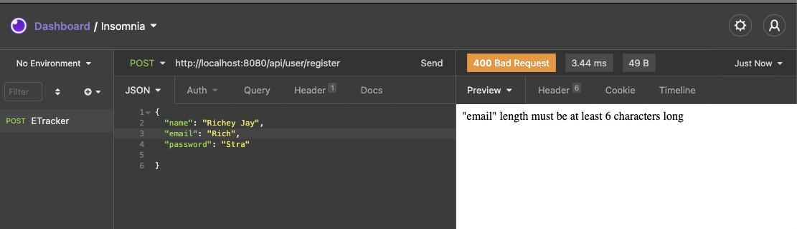
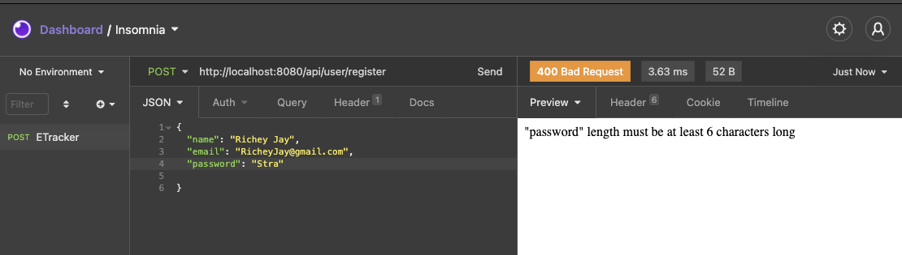
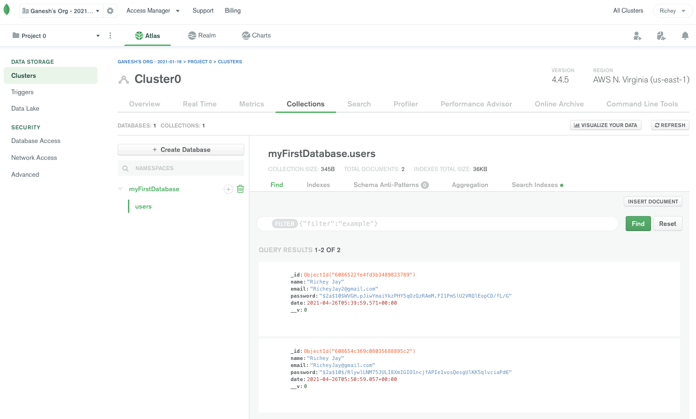

# A Node.js API with authentication JWT

## Creating a user 

## Email already exists test case

## Email already exists test case

## Email already exists test case

## Email already exists test case

